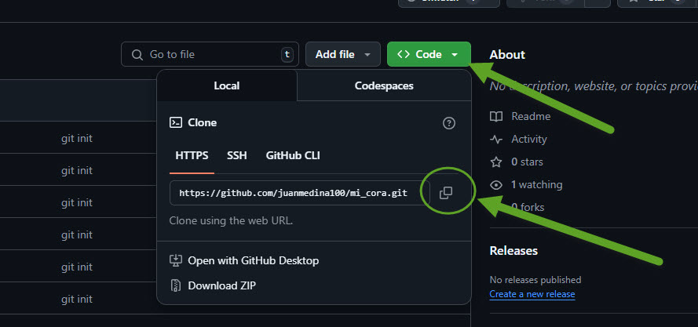

# Directrices de contribución.

Para contribuir al proyecto **Mi Cora** como colaborador directo debes seguir los siguientes pasos:

### Primer contacto con el proyecto.

- 1 - Clona el proyecto (clona desde la rama master):

``` 
git clone https://github.com/juanmedina100/mi_cora.git
```

- 2 - Crea una nueva rama en tu proyecto (así trabajas tu asignación directa en esa rama).

- 3 - Revisa tu asignación y modifica solo los archivos que tienen que ver con ella.

- 4 - Para cada commit que vayas a realizar recuerdaa que al principio del commit debe llevar información aluciba a la contribución, ejemplo: 

"Creación de widget (aca el nombre del widget)" cuando se este creando por primera vez.

"Modificación de widget (aca el nombre del widget modificado)" para cuando se haga actualización de widget.

"Creando Provider (nombre de provider)" para creación de provider.

"Modificación de Provider (aca el nombre del provider)" para modificar mejorar provider.

De esa forma segun lo que se este agregando o modificando debe llevar ese titulo al inicio de cada commit.


- 5 - Terminada tu asignación y comprobando que todo funciona bien actualiza tu rama en github (nunca al **master**).

### Si estas haciendo una segunda, tercera, etc colaboración.

- 1 - Haz pull de tu proyecto (si se te compleca hacer un pull de forma correcta elimina tu proyecto local y haz un git clone al repositorio remoto).


## Anexos.

### Donde encuentro la dirección que debo clonar.




