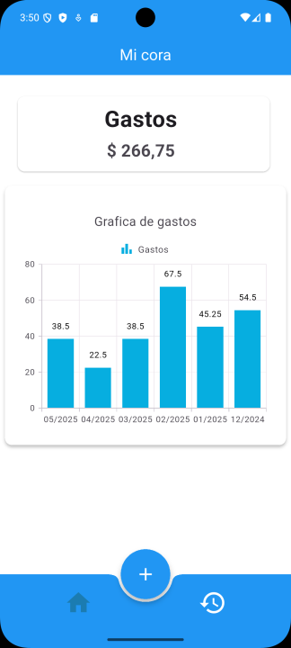
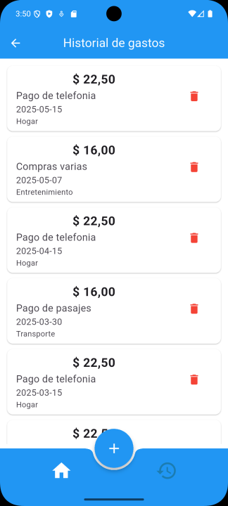
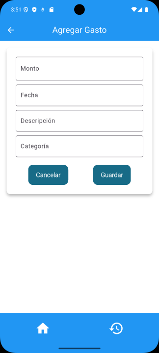
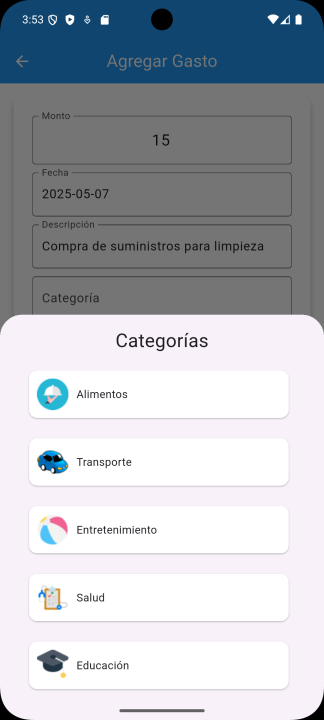
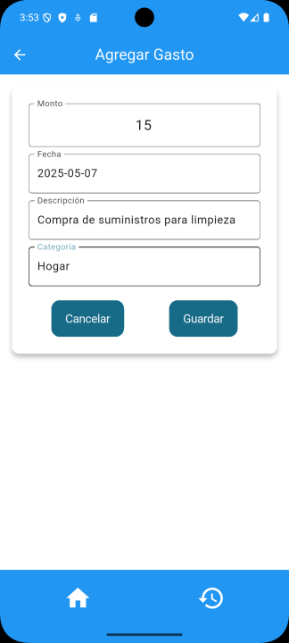
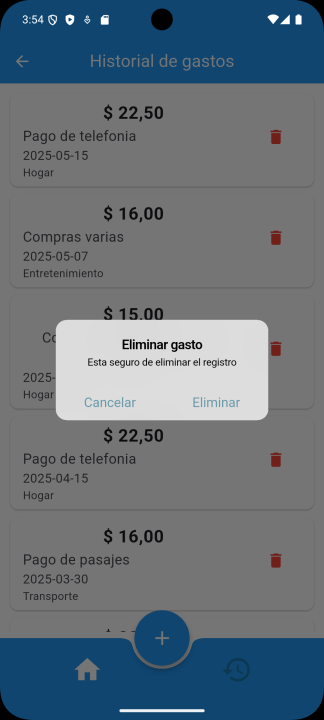

# 🚀 Mi Cora : Mi gestión de gastos personal


**Mi Cora**, es una aplicación móvil desarrollada en **Flutter y SQLite** como parte del proyecto de la asignatura **Desarrollo de Aplicaciones Móviles 01-2025** (DAM) de la carrera **Tecnico Superior Universitario (TSU) en Desarrollo de Software en Código Abierto** en **Escuela Superior de Innovación y Tecnología de El Salvador (ESIT).** 

Su propósito es facilitar el control de gastos personales de forma sencilla, intuitiva y funcional. La aplicación permite registrar, visualizar, editar y eliminar transacciones, todo almacenado de forma local en una base de datos **SQLite**. 


## 📸 Capturas de pantalla

| Splash Screen | Dashboard | Historial de transacciones |
|---------------------|---------------------|---------------------|
|  |  |  |

| Agregar gasto 1 | Agregar gasto 2 | Agregar gasto 3 |
|---------------------|---------------------|---------------------|
|  |  |  |

| Eliminar gasto | 
|---------------------|
|  | 


## Funciones principales

| Función                 | Descripción |
|------------------------|--------------------------------|
| 🚍 DashBoard  | Verifica los gastos realizados en los ultimos 6 meses |
| 📌 Registro de transacciones | Guarda gastos fácilmente |
| ✏️ Edición de transacciones | Modifica detalles de transacciones |
| 🗑️ Suprimir transacciones | Elimina registros innecesarios |
| 📜 Historial de transacciones | Revisa gastos anteriores |

## Seguridad y almacenamiento

### ¿Porque usamos SQLte y no Shared preferences?

Usar **SQLite** en lugar de **Shared Preferences** en **Mi Cora** tiene varias ventajas, especialmente cuando se necesita manejar datos estructurados de manera eficiente. Explico las principales ventajas:

### **Ventajas de SQLite sobre Shared Preferences**  
1. **Almacenamiento estructurado** 📊  
   - SQLite permite almacenar datos en formato de tabla con relaciones, facilitando consultas complejas.  
   - Shared Preferences solo guarda pares clave-valor, lo que limita la estructura de datos.

2. **Soporte para consultas avanzadas** 🔍  
   - Puedes hacer búsquedas filtradas, ordenadas y realizar análisis más detallados con SQL.  
   - Shared Preferences solo permite obtener valores individuales o listas simples.

3. **Mejor rendimiento en grandes volúmenes de datos** 🚀  
   - SQLite está optimizado para manejar grandes cantidades de información sin afectar el rendimiento.  
   - Shared Preferences empieza a volverse lento si almacenas demasiados datos.

4. **Seguridad y encriptación** 🔒  
   - SQLite permite técnicas de encriptación para proteger la base de datos.  
   - Shared Preferences almacena datos en archivos XML, que pueden ser menos seguros.

5. **Transacciones y consistencia** ✅  
   - Puedes realizar transacciones en SQLite para garantizar la integridad de los datos.  
   - Shared Preferences no tiene soporte para transacciones, lo que puede causar pérdida de datos en ciertos escenarios.

6. **Escalabilidad** 📈  
   - Si tu aplicación crece y necesita manejar más datos, SQLite es la mejor opción.  
   - Shared Preferences es útil solo para configuraciones básicas o preferencias del usuario.


## 📥 Instalación
1. Clona el repositorio:  
   ```bash
   git clone https://github.com/juanmedina100/mi_cora.git
    ```
2. Instalar dependencias:
    ```bash
    flutter pub get
    ```

3. Correr aplicaci+on:
    ```bash
    flutter run
    ```